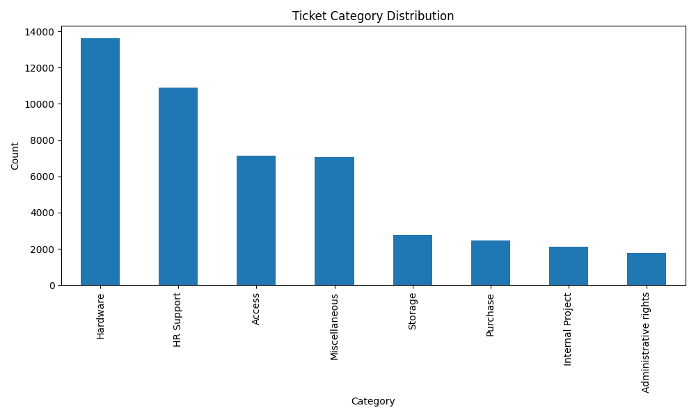
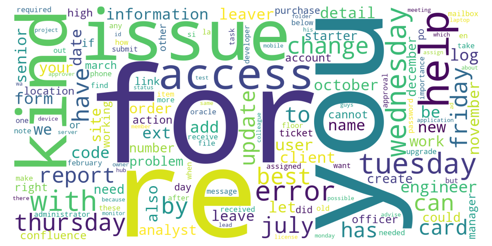
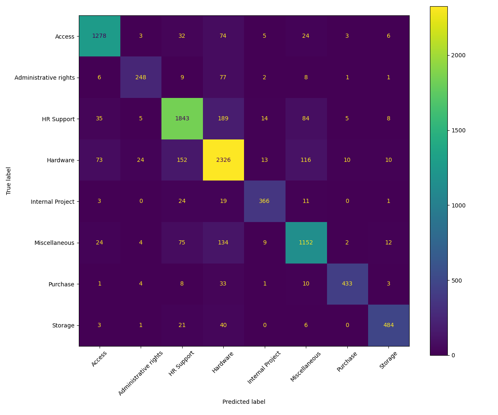

# Support Ticket Classification System

## Overview

This project uses Natural Language Processing (NLP) and Machine Learning to automatically classify support tickets into different categories.

The system analyzes ticket text, predicts the appropriate ticket category, and provides support analytics through visualizations.

## Dataset

Dataset: Support Ticket Dataset

Features Used:

* Document (Ticket Text)
* Topic Group (Ticket Category)

Categories:

* Hardware
* HR Support
* Access
* Storage
* Purchase
* Internal Project
* Administrative Rights
* Miscellaneous

## Technologies Used

* Python
* Pandas
* Scikit-Learn
* Matplotlib
* WordCloud

## Machine Learning Workflow

1. Data Loading
2. Text Preprocessing
3. TF-IDF Vectorization
4. Train-Test Split
5. Model Training using LinearSVC
6. Ticket Category Prediction
7. Model Evaluation
8. Support Analytics Visualization

## Model Performance

The model was trained using TF-IDF and LinearSVC for multi-class ticket classification.

Evaluation Metrics:

* Accuracy Score
* Precision
* Recall
* F1-Score

## Visualizations

### Category Distribution

### Word Cloud

### Confusion Matrix

## Sample Prediction

Input:

please reset my password and unlock my account

Predicted Category:

Access

## Business Applications

* Automated Ticket Routing
* Faster Customer Support
* Reduced Manual Classification
* Improved Service Desk Efficiency
* Intelligent Helpdesk Systems

## Project Structure

FUTURE_ML_02

├── data

├── outputs

├── screenshots

├── main.py

├── README.md

└── requirements.txt

## Future Improvements

* Deep Learning Models
* BERT-based Classification
* Real-time Ticket Prediction
* Priority Prediction System
* Interactive Dashboard
